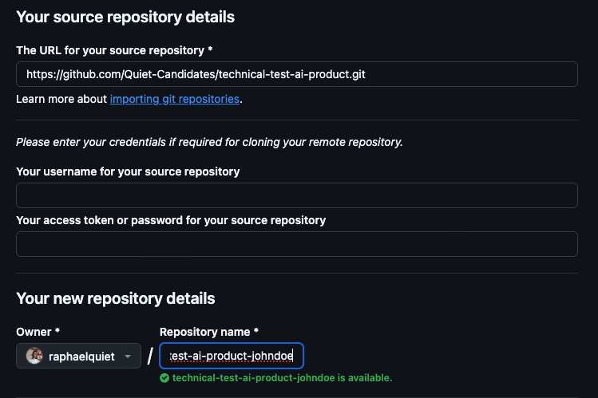
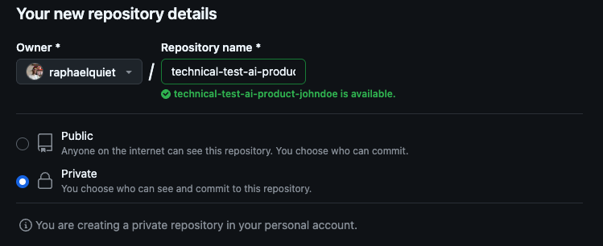
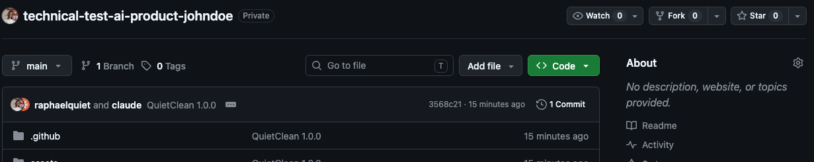
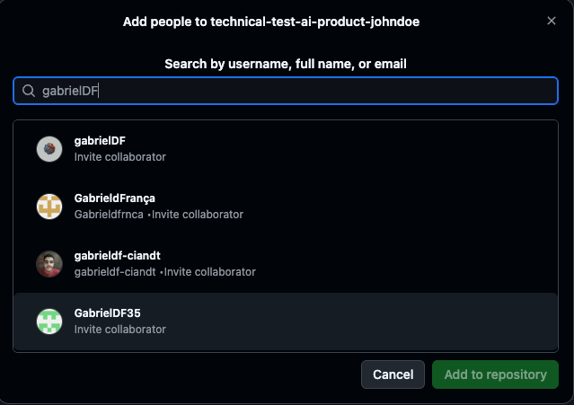

# Share your code

We need to read your code, and we need it to stay private.

Please **DO NOT** make your work public. Follow these steps. Do step 1 **before you start coding**.

## 1 — Import this repo into a private repository

Do not fork. A fork of a public repo is public. Use GitHub's **Import** feature instead.

Open <https://github.com/new/import> and fill it in:

* **Your old repository's clone URL**: `https://github.com/Quiet-Candidates/technical-test-ai-product.git`
* **Repository name**: `technical-test-ai-product-<your_github_nickname>`
* **Privacy**: **Private**

<p align="center">

</p>

<p align="center">

</p>

You should end up with a private repository under your own account.

<p align="center">

</p>

## 2 — Clone it

```bash
git clone https://github.com/<your_github_nickname>/technical-test-ai-product-<your_github_nickname>.git
cd technical-test-ai-product-<your_github_nickname>
```

## 3 — Create a working branch

```bash
git checkout -b my-solution
```

You will open your pull request from this branch, against the `main` of **your own private copy**.

## 4 — Work

Commit and push as you go.

## 5 — Add us as collaborators — **WHEN YOU ARE READY**

When your work is done and you want us to read it, add these people as collaborators on your
repository (**Settings → Collaborators → Add people**):

* `raphaelquiet`
* `gabrielDF`

<p align="center">

</p>

Then open a pull request from `my-solution` into your `main`.

Finally, send us the **URL of your pull request**.

At that point we consider the test finished.

## 6 — Do not merge

**Leave the pull request open.**

We review it there. We will leave comments and ask questions. Keep an eye on it and answer them — the
conversation on the PR is part of what we read.

## 7 — Wait

We come back to you once the review is done.
